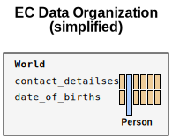
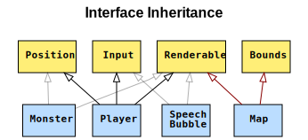
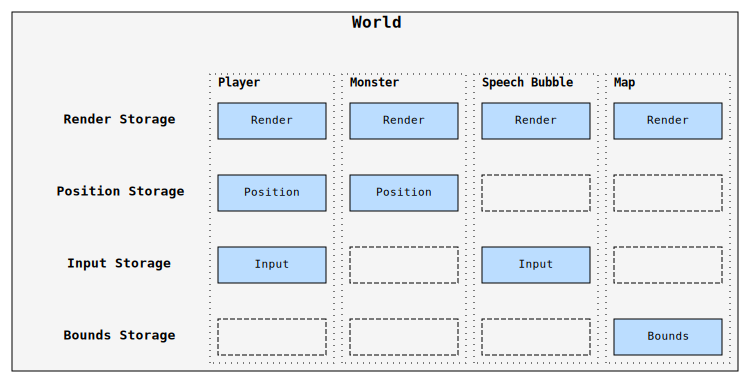
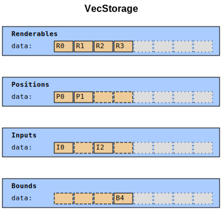
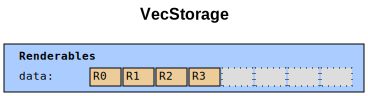
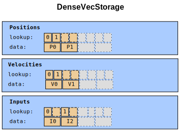
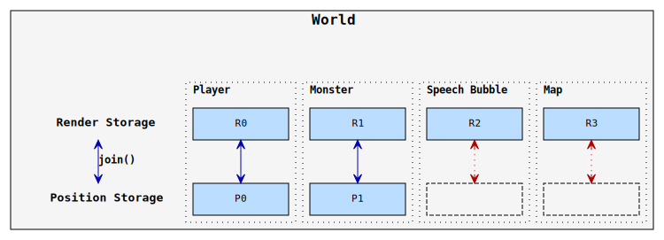
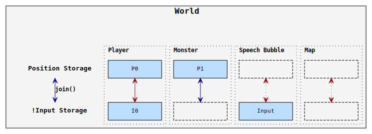
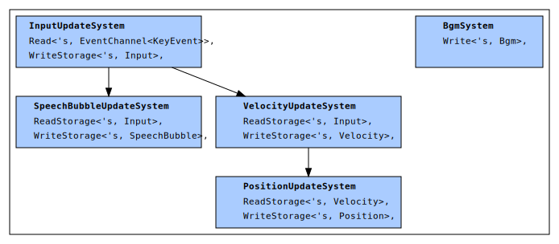

## ECS: A Programming Paradigm

Azriel Hoh

---

### About

* **Before:** Automated distributed system management.
* **Now:** Making a Rust game.

+++

### Agenda

1. Data Organisation
    - Hierarchical: Array of Structs
    - Struct of Arrays
2. Entity Component model
3. Logic
    - MVC
    - Systems
    - Dispatcher
4. Summary
    - Trade-offs

---

### Data: Hierarchical

We usually define data types hierarchically:

<svg width="362pt" height="309pt"
 viewBox="0.00 0.00 362.00 309.00" xmlns="http://www.w3.org/2000/svg" xmlns:xlink="http://www.w3.org/1999/xlink">
<g id="graph0" class="graph" transform="scale(1 1) rotate(0) translate(4 305)">
<title>Person</title>
<text text-anchor="start" x="64.5" y="-285.2" font-family="Arial" font-weight="bold" font-size="16.00">Hierarchical data organization</text>
<!-- address -->
<g id="node1" class="node"><title>address</title>
<polygon fill="#bbddff" stroke="black" points="113,-52 0,-52 0,-0 113,-0 113,-52"/>
<text text-anchor="start" x="8" y="-40.2" font-family="consolas" font-weight="bold" font-size="11.00">Address</text>
<text text-anchor="start" x="8" y="-29.2" font-family="consolas" font-size="11.00">country: Country</text>
<text text-anchor="start" x="8" y="-18.2" font-family="consolas" font-size="11.00">state: State</text>
<text text-anchor="start" x="8" y="-7.2" font-family="consolas" font-size="11.00">city: String</text>
</g>
<!-- contact_details -->
<g id="node2" class="node"><title>contact_details</title>
<polygon fill="#bbddff" stroke="black" points="211,-156.5 44,-156.5 44,-115.5 211,-115.5 211,-156.5"/>
<text text-anchor="start" x="52" y="-144.7" font-family="consolas" font-weight="bold" font-size="11.00">ContactDetails</text>
<text text-anchor="start" x="52" y="-133.7" font-family="consolas" font-size="11.00">address: Address</text>
<text text-anchor="start" x="52" y="-122.7" font-family="consolas" font-size="11.00">phone_number: PhoneNumber</text>
</g>
<!-- contact_details&#45;&gt;address -->
<g id="edge3" class="edge"><title>contact_details&#45;&gt;address</title>
<path fill="none" stroke="black" d="M114.642,-115.442C104.615,-100.188 90.4499,-78.6421 78.6122,-60.6354"/>
<polygon fill="black" stroke="black" points="81.4342,-58.5566 73.0162,-52.1232 75.5849,-62.4019 81.4342,-58.5566"/>
</g>
<!-- phone_number -->
<g id="node5" class="node"><title>phone_number</title>
<polygon fill="#bbddff" stroke="black" points="268,-46.5 131,-46.5 131,-5.5 268,-5.5 268,-46.5"/>
<text text-anchor="start" x="139" y="-34.7" font-family="consolas" font-weight="bold" font-size="11.00">PhoneNumber</text>
<text text-anchor="start" x="139" y="-23.7" font-family="consolas" font-size="11.00">country_code: String</text>
<text text-anchor="start" x="139" y="-12.7" font-family="consolas" font-size="11.00">area_code: String</text>
</g>
<!-- contact_details&#45;&gt;phone_number -->
<g id="edge4" class="edge"><title>contact_details&#45;&gt;phone_number</title>
<path fill="none" stroke="black" d="M140.539,-115.442C151.733,-98.6498 168.012,-74.2313 180.63,-55.3045"/>
<polygon fill="black" stroke="black" points="183.68,-57.0394 186.315,-46.7774 177.856,-53.1565 183.68,-57.0394"/>
</g>
<!-- date_time -->
<g id="node3" class="node"><title>date_time</title>
<polygon fill="#bbddff" stroke="black" points="354,-184 229,-184 229,-88 354,-88 354,-184"/>
<text text-anchor="start" x="237" y="-172.2" font-family="consolas" font-weight="bold" font-size="11.00">DateTime</text>
<text text-anchor="start" x="237" y="-161.2" font-family="consolas" font-size="11.00">year: u64</text>
<text text-anchor="start" x="237" y="-150.2" font-family="consolas" font-size="11.00">month: u64</text>
<text text-anchor="start" x="237" y="-139.2" font-family="consolas" font-size="11.00">day: u64</text>
<text text-anchor="start" x="237" y="-128.2" font-family="consolas" font-size="11.00">hours: u64</text>
<text text-anchor="start" x="237" y="-117.2" font-family="consolas" font-size="11.00">minutes: u64</text>
<text text-anchor="start" x="237" y="-106.2" font-family="consolas" font-size="11.00">seconds: u64</text>
<text text-anchor="start" x="237" y="-95.2" font-family="consolas" font-size="11.00">timezone: TimeZone</text>
</g>
<!-- person -->
<g id="node4" class="node"><title>person</title>
<polygon fill="#bbddff" stroke="black" points="311,-261 108,-261 108,-220 311,-220 311,-261"/>
<text text-anchor="start" x="116" y="-249.2" font-family="consolas" font-weight="bold" font-size="11.00">Person</text>
<text text-anchor="start" x="116" y="-238.2" font-family="consolas" font-size="11.00">contact_details: ContactDetails</text>
<text text-anchor="start" x="116" y="-227.2" font-family="consolas" font-size="11.00">date_of_birth: DateTime</text>
</g>
<!-- person&#45;&gt;contact_details -->
<g id="edge1" class="edge"><title>person&#45;&gt;contact_details</title>
<path fill="none" stroke="black" d="M193.69,-219.737C181.211,-204.139 163.65,-182.188 149.752,-164.815"/>
<polygon fill="black" stroke="black" points="152.242,-162.325 143.262,-156.702 146.776,-166.698 152.242,-162.325"/>
</g>
<!-- person&#45;&gt;date_time -->
<g id="edge2" class="edge"><title>person&#45;&gt;date_time</title>
<path fill="none" stroke="black" d="M225.31,-219.737C231.7,-211.75 239.423,-202.097 247.303,-192.246"/>
<polygon fill="black" stroke="black" points="250.121,-194.326 253.635,-184.331 244.655,-189.953 250.121,-194.326"/>
</g>
</g>
</svg>

+++

### Data: Hierarchical

In code, that looks something like this:

```rust
struct Person {
    contact_details: ContactDetails,
    date_of_birth: DateTime<Utc>,
}

struct ContactDetails { /* fields */ }
struct DateTime<Tz> { /* fields */ }
```

+++

### Data: Hierarchical

A list of people can be stored like this:

```rust
struct World {
    people: Vec<Person>,
}
```

This layout is known as *arrays of structs* (AOS).

---

### Data: Struct of Arrays

Split `Person` into parts, keep the same parts together:

```rust
struct World {
    contact_detailses: Vec<ContactDetails>,
    date_of_births: Vec<DateTime<Utc>>,
}
```

Each index into the `Vec<_>`s represents a person.

Need to make sure `Vec<_>`s have the same length.

+++

### Data: Struct of Arrays

In picture form:



A `Person` is a vertical slice from both `Vec<_>`s.

`Person` no longer exists, it's now an abstract concept.

+++

### Data: Struct of Arrays


Why would anyone want to do that?

---

### Calculate Average Age

+++

### Calculate Average Age

Formula:

```rust
average_age = total_age / number_of_people
```

+++

### Calculate Average Age

```rust
struct Person {
    contact_details: ContactDetails,
    date_of_birth: DateTime<Utc>,
}

let people: Vec<Person> = /* ... */;
let now = Utc::now();

let mean_age = people
    .iter()
    // Sum everyone's age
    .fold(0., |sum, p| sum + years_since(p.date_of_birth, now))
    // Divide by number of people
    / people.len() as f32
```

+++

### Memory Access

Here is the data that we iterate over:

<table style="font-size: 0.6em;">
    <tr><td rowspan="3">P0</td><td rowspan="2" bgcolor="#eecc99">Contact Details</td><td bgcolor="#eecc99">Address</td></tr>
    <tr><td bgcolor="#eecc99">Phone Number</td></tr>
    <tr><td bgcolor="#eecc99">Date of Birth</td></tr>

    <tr><td rowspan="3">P1</td><td rowspan="2" bgcolor="#eecc99">Contact Details</td><td bgcolor="#eecc99">Address</td></tr>
    <tr><td bgcolor="#eecc99">Phone Number</td></tr>
    <tr><td bgcolor="#eecc99">Date of Birth</td></tr>

    <tr><td rowspan="3">P2</td><td rowspan="2" bgcolor="#eecc99">Contact Details</td><td bgcolor="#eecc99">Address</td></tr>
    <tr><td bgcolor="#eecc99">Phone Number</td></tr>
    <tr><td bgcolor="#eecc99">Date of Birth</td></tr>

    <tr><td rowspan="3">P3</td><td rowspan="2" bgcolor="#eecc99">Contact Details</td><td bgcolor="#eecc99">Address</td></tr>
    <tr><td bgcolor="#eecc99">Phone Number</td></tr>
    <tr><td bgcolor="#eecc99">Date of Birth</td></tr>
</table>

+++

### Memory Access

Here is the data that we need:

<table style="font-size: 0.6em;">
    <tr><td rowspan="3">P0</td><td rowspan="2" bgcolor="#eecc99">Contact Details</td><td bgcolor="#eecc99">Address</td></tr>
    <tr><td bgcolor="#eecc99">Phone Number</td></tr>
    <tr><td bgcolor="#aaccff">Date of Birth</td></tr>

    <tr><td rowspan="3">P1</td><td rowspan="2" bgcolor="#eecc99">Contact Details</td><td bgcolor="#eecc99">Address</td></tr>
    <tr><td bgcolor="#eecc99">Phone Number</td></tr>
    <tr><td bgcolor="#aaccff">Date of Birth</td></tr>

    <tr><td rowspan="3">P2</td><td rowspan="2" bgcolor="#eecc99">Contact Details</td><td bgcolor="#eecc99">Address</td></tr>
    <tr><td bgcolor="#eecc99">Phone Number</td></tr>
    <tr><td bgcolor="#aaccff">Date of Birth</td></tr>

    <tr><td rowspan="3">P3</td><td rowspan="2" bgcolor="#eecc99">Contact Details</td><td bgcolor="#eecc99">Address</td></tr>
    <tr><td bgcolor="#eecc99">Phone Number</td></tr>
    <tr><td bgcolor="#aaccff">Date of Birth</td></tr>
</table>

---

### Calculate Average Age: SOA

```rust
let contact_detailses: Vec<ContactDetails> = /* ... */;
let date_of_births: Vec<DateTime> = /* ...  */;
let world = World { contact_detailses, date_of_births };

let now = Utc::now();

// Note: we don't actually read `contact_detailses`.
let mean_age = world
    .date_of_births
    .iter()
    // Sum everyone's age
    .fold(0., |sum, dob| sum + years_since(*dob, now))
    // Divide by number of people
    / world.date_of_births.len() as f32
```

+++

### Memory Access: SOA

Here is the data that we iterate over:

<table style="font-size: 0.6em;">
    <tr><td>D0</td><td bgcolor="#eecc99">Date of Birth</td></tr>
    <tr><td>D1</td><td bgcolor="#eecc99">Date of Birth</td></tr>
    <tr><td>D2</td><td bgcolor="#eecc99">Date of Birth</td></tr>
    <tr><td>D3</td><td bgcolor="#eecc99">Date of Birth</td></tr>
</table>

+++

### Memory Access: SOA

Here is the data that we need:

<table style="font-size: 0.6em;">
    <tr><td>D0</td><td bgcolor="#aaccff">Date of Birth</td></tr>
    <tr><td>D1</td><td bgcolor="#aaccff">Date of Birth</td></tr>
    <tr><td>D2</td><td bgcolor="#aaccff">Date of Birth</td></tr>
    <tr><td>D3</td><td bgcolor="#aaccff">Date of Birth</td></tr>
</table>

+++

### Memory Access: SOA

What significance does this have?

---

### Caching: Data Locality

When you fetch data, the computer thinks:

**Maybe I should fetch more!**


+++

### Caching: Data Locality

<table style="font-size: 0.6em;">
<tr><td></td><td>Hierarchical</td><td></td><td>SOA</td></tr>
<tr><td rowspan="10">Cache<br />Capacity</td><td rowspan="2">P0</td><td rowspan="10"></td><td>DateTime0</td></tr>
<tr><td>DateTime1</td></tr>
<tr><td rowspan="2">P1</td><td>DateTime2</td></tr>
<tr><td>DateTime3</td></tr>
<tr><td rowspan="2">P2</td><td>DateTime4</td></tr>
<tr><td>DateTime5</td></tr>
<tr><td rowspan="2">P3</td><td>DateTime6</td></tr>
<tr><td>DateTime7</td></tr>
<tr><td rowspan="2">P4</td><td>DateTime8</td></tr>
<tr><td>DateTime9</td></tr>
</table>

---

### Benchmark: AOS vs SOA

 [azriel91/aos_vs_soa/lib.rs#L112-L117](https://github.com/azriel91/aos_vs_soa/blob/master/src/lib.rs#L112-L117)

```bash
git clone git@github.com:azriel91/aos_vs_soa.git
cd aos_vs_soa
cargo bench
```

+++

### Benchmark: AOS vs SOA

Sample output:

```bash
running 2 tests
test tests::array_of_structs::avg_age ... bench:   2,427,309 ns/iter (+/- 201,343)
test tests::struct_of_arrays::avg_age ... bench:   2,192,988 ns/iter (+/- 136,117)

test result: ok. 0 passed; 0 failed; 0 ignored; 2 measured; 0 filtered out
```

+++

### Benchmark: AOS vs SOA

```
name       aos ns/iter  soa ns/iter  diff ns/iter  diff %  speedup
::avg_age  2,427,309    2,192,988        -234,321  -9.65%   x 1.11
::avg_age  2,438,766    2,215,783        -222,983  -9.14%   x 1.10
::avg_age  2,444,267    2,196,445        -247,822 -10.14%   x 1.11
::avg_age  2,430,973    2,195,141        -235,832  -9.70%   x 1.11
::avg_age  2,462,707    2,185,442        -277,265 -11.26%   x 1.13
::avg_age  2,414,035    2,211,378        -202,657  -8.39%   x 1.09
::avg_age  2,431,339    2,219,773        -211,566  -8.70%   x 1.10
::avg_age  2,433,808    2,225,186        -208,622  -8.57%   x 1.09
::avg_age  2,404,514    2,175,141        -229,373  -9.54%   x 1.11
::avg_age  2,409,768    2,200,761        -209,007  -8.67%   x 1.09
```

---

Breather

---

### Scenario: Game

<table>
<tr>
    <td>
        <b>Player</b><br/>
        <ul>
            <li>Render</li>
            <li>Position</li>
            <li>Input</li>
        </ul>
    </td>
    <td>
        <b>Monster</b><br/>
        <ul>
            <li>Render</li>
            <li>Position</li>
        </ul>
    </td>
</tr>
<tr>
    <td>
        <b>Speech Bubble</b><br/>
        <ul>
            <li>Render</li>
            <li>Input</li>
        </ul>
    </td>
    <td>
        <b>Map</b><br/>
        <ul>
            <li>Render</li>
            <li>Bounds</li>
        </ul>
    </td>
</tr>
</table>

+++

### OO Model

* **G**ood **O**bject **O**riented **D**esign (GOOD)
    - Interface inheritance
    - Composition
* **O**bject **O**riented **P**rogramming **S**yntax (OOPS)
    - Implementation inheritance

+++

### OO Model



+++

### OO Model

In code:

```rust
trait Renderable {}
trait Position {}
trait Input {}

struct Player;
impl Renderable for Player {}
impl Position for Player {}
impl Input for Player {}

struct Monster;
impl Renderable for Monster {}
impl Position for Monster {}

struct World {
    players: Vec<Player>,
    monsters: Vec<Monster>,
}
```

---

### EC Model

Some `Component`s only apply to some entities.



+++

### EC Model

In code, components can be represented like this:

```rust
struct World {
    // Note: Can't simply store traits like this,
    // In this example, components must be concrete types
    renderables: Vec<Option<Renderable>>,
    positions: Vec<Option<Position>>,
    inputs: Vec<Option<Input>>,
    bounds: Vec<Option<Bound>>,

    // How to track each type of entity? `usize`!
    players: Vec<usize>,
    monsters: Vec<usize>,
    speech_bubbles: Vec<usize>,
    maps: Vec<usize>,
}
```

+++

### EC Model

Problem?

+++

### EC Model

More like, problems!

* **Memory bloat:** Unused slots.
* **Entity creation:** Finding a free index.
    - **Overflow:** What if we run out of indices?
* **Entity deletion:**
    - **Mutable access:** Remove components from all storages.
    - **Can we delete:** Is anyone referencing this entity?

---

Breather

---

### Generational Arena

+++

### Generational Arena

Arena? The Colosseum!


+++

### Generational Arena

**Arena:** Request a chunk of memory, and manage it yourself.

**Generational:** Use a *generational index* to track free space in the arena.

+++

### Generational Arena

Key concepts:

* Keep a pool of memory, remember which slots are "empty" (deleted)
* When a slot is re-used, increment the generation by 1, so we know the memory is a different entity.

+++

### Generational Arena

Instead of:

* `Vec<T>` where `T` is the stored component
* An incrementing `usize` to track next free index

Use `Vec<Entry<T>>`, where `Entry` is:

```rust
enum Entry {
    Free { next_free: Option<usize> },
    Occupied { generation: u64, value: T },
}
```

+++

### Generational Arena

Instead of referencing an entity by `usize`, use:

```rust
#[derive(Eq, PartialEq, ..)]
pub struct GenerationalIndex {
    index: usize,
    generation: u64,
}
```

If the generation does not match, it's a different entity.

+++

### Generational Arena

Solves:

* **Memory bloat:** ❌ Unused slots.
* **Entity creation:** Finding a free index.
    - ✔️ **Overflow:** Reuse existing indicies
* **Entity deletion:**
    - ✔️ **Mutable access:** Old gen signals absence.
    - ⭕ **Can we delete:** Old gen signals absence.

---

### EC Storages

+++

### EC Storages

`VecStorage` can be a waste of memory:



+++

### EC Storages

`Vec` is optimal for frequent components:



+++

### EC Storages

A lookup `Vec` saves memory for common components:



+++

### EC Storages

Rare components can be stored using a `HashMap`:


+++

### EC Storages

Solves:

* **Memory bloat:** ✔️ Unused slots.
* **Entity creation:** Finding a free index.
    - ✔️ **Overflow:** Reuse existing indicies
* **Entity deletion:**
    - ✔️ **Mutable access:** Old gen signals absence.
    - ⭕ **Can we delete:** Old gen signals absence.

---

Breather

---

### Logic

+++

### Task: Update Positions

`Player`s and `Monster`s have a position and velocity.

Write a function to update position based on velocity.

```rust
position += velocity
```

+++

### Logic: OO

> Write the `update` function inide the `class`.  
> Hiding the code means better encapsulation.
>
> &ndash; every CS course *(paraphrased)*

+++

### Logic: OOPS

How to increase software maintenance costs:

```rust
impl PositionUpdate for Player {
    fn update(&mut self) {
        self.pos += self.vel;
    }
}

impl PositionUpdate for Monster {
    fn update(&mut self) {
        self.pos += self.vel;
    }
}
```

+++

### Logic: GOOD (MVC)

```rust
type Kinematic = i32;
impl Positionable for Player { fn pos_mut(&mut self) -> &mut Kinematic { &mut self.pos } }
impl Positionable for Monster { fn pos_mut(&mut self) -> &mut Kinematic { &mut self.pos } }
impl Movable for Player { fn vel(&self) -> &Kinematic { &self.vel } }
impl Movable for Monster { fn vel(&self) -> &Kinematic { &self.vel } }

trait GameObject: Positionable + Movable {}
fn position_update(game_objects: &mut [Box<GameObject>]) {
    for i in 0..game_objects.len() {
        let vel = game_objects[i].vel();
        *game_objects[i].pos_mut() += *vel;
    }
}
```

 [playpen](https://play.rust-lang.org/?version=stable&mode=debug&edition=2015&gist=f8e4a16d89d4bdd80d12095c837e5cc1)

+++

### Logic: GOOD (MVC)

* Logic is generally pretty clean
* Difficult to update objects due to borrowing rules

---

### Systems

+++

### Systems

The **S** in **ECS**.

+++

### Systems

Compare:

```rust
/// OO position_update():
for i in 0..game_objects.len() {
    *game_objects[i].pos_mut() += *game_objects[i].vel();
}

// PositionSystem update():
for (mut pos, vel) in (&mut positions, &vels).join() {
    pos += vel;
}
```

+++

### Systems

Remember this:


+++

### Systems

```rust
// Whitelist components (must haves)
(&renderables, &positions).join() -> [(R0, P0), (R1, P1)]
```



+++

### Systems

```rust
// Exclude / blacklist components
(&positions, !&inputs).join() -> [(R1, ())]
```



---

### Lock & Key Analogy

Given this lock:


+++

### Lock & Key Analogy

This key works:


+++

### Lock & Key Analogy

So does this:


+++

### Lock & Key Analogy

But not this:


+++

### Lock & Key Analogy

For this lock:


+++

### Lock & Key Analogy

This key works:


+++

### Lock & Key Analogy

But not this:


---

### Dispatcher

+++

### Dispatcher

* System graph
* Thread pool
* Execution
    - Parallel
    - Safe: multiple readers / exclusive writer

+++

### Dispatcher: System Graph



 [specs/examples/full.rs#L221-L230](https://github.com/slide-rs/specs/blob/b22955b6487b53c22117a77cd93ee2ad78e31711/examples/full.rs#L221-L230)

+++

### Dispatcher: Thread Pool


---

### Takeaways

* Compare GOOD with ECS, not OOPS with ECS
* It's a trade-off.

|     | OO  | EC  |
| --- | --- | --- |
| Logical partitioning                  | State | Behaviour |
| Visible concrete model                |  ✔️  |     |
| Optimized for cache usage<sup>1</sup> |       | ✔️ |
| Borrow-checker management<sup>2</sup> |       | ✔️ |

<sup>1</sup> Only because Rust doesn't do auto-vectorization.
<sup>2</sup> Ease of passing data for parallelization

---

### Thanks!

* Catherine West / `@Kyrenite`: Learnt *a lot* from her blog.
* The `specs` team: Who have written such a great library.
* Maik Klein: For the tip about auto-vectorization.

---

### Links

* Slides: https://github.com/azriel91/ecs_a_programming_paradigm
* RustConf 2018 Closing Keynote: https://www.youtube.com/watch?v=P9u8x13W7UE
* `@Kyrenite`'s Blog: https://kyren.github.io/2018/09/14/rustconf-talk.html
* `specs` (crate): https://crates.io/crates/specs
* Benchmark comparison: https://github.com/azriel91/aos_vs_soa
* Data Locality: http://gameprogrammingpatterns.com/data-locality.html
